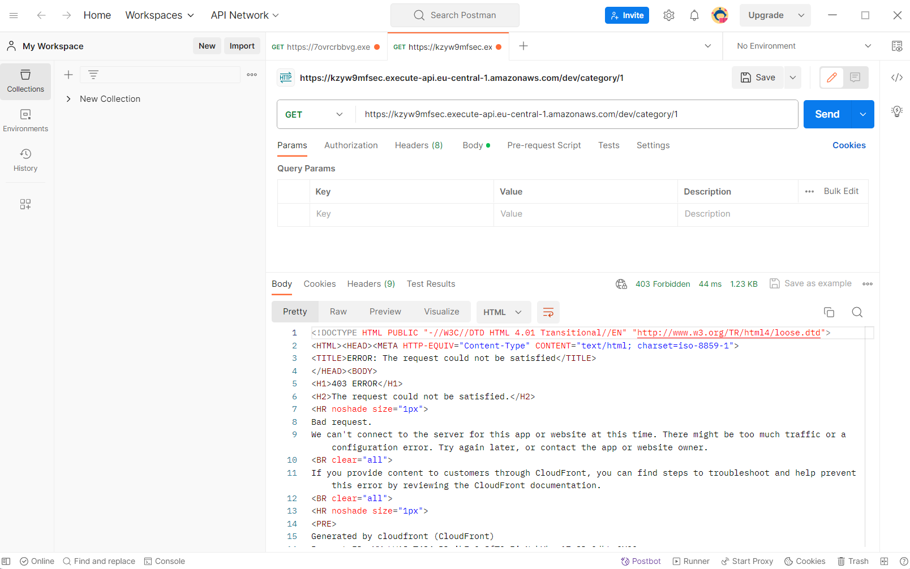

# Розробка REST API з використанням Amazon Web Services (Lambda, RDS...), фреймворку Serverless на TypeScript

## Що я маю на увазі
Я використовуватиму сервіси AWS, для запитів буде використовуватись Lambda і відповідати вона буде на http запити (логічно, адже інших сервісів, що давали б завдання, тут нема). Не буде використовуватись express, fastify, http модуль в node і так далі. Маршрутизація через вбудовані засоби лямбд. Також буде практично все через фреймворк serverless щоб дотримуватись підходу інфраструктура як код. У мене буде саме проєкт написаний не на C#, не на Python, а на TypeScript. Також, проєкт зроблений, щоб йоговивантажити до AWS. Ви не зможете його запустити локально. Я не кажу що мій варіант сервісу єдиний чи хоч найкращий, але він має право на життя.

### Посилання
[Вичерпний гайд схожого сенсу, який включає можливість тестувати ЛОКАЛЬНО](https://towardsaws.com/create-your-first-serverless-graphql-api-with-aws-lambda-and-mysql-database-69d5c4d76457) //я не використовував, знайшов вже після.

## Вступ, Переваги AWS

Чому варто обрати саме цей варіант перед іншими? 
1. Справа в тому, що на відміну від створення певного застосунку й подальшого його "захощування" асазон пропонує дуже широкі можливості. Ви можете вибирати споміж багатьох сервісів, що дозволить не розбиратись окремо з застосунком, окремо з постачальником серверів і окремо з базою даних. AWS надає все цее й навіть більше.
2. Він не дуже складний. Можна спокійно писати невеликі сервіси. Не треба робити величезний додаток для звичайного helloworld.
3. Просто масштабується. Якщо вам знадобиться щось додати, вам не треба починати все заново. Додавання нових модулів і сервісів (особливо якщо вони теж частина AWS) справа досить легка. Особливо це через можливість використання serverless сервісів. Це дозволяє фокусуватись на коді, а не на проблемах з серверами.
4. Власне, оця serverless-ність. Не всі сервіси такі, але є велика кількість тих, що не використовують. Без серверів ви платитимете лише за використані ресурси (поки ви платити ні за що не будете), розширювати такі додатки одне задоволення. Та й deployяться швидко.
5. Глобальна доступність. Загалом, ви можете отримати доступ до додатку з будь-якої точки світу. Якось так.
6. Безпека. Як ви побачите, обмеження прав є, та й взагалі рішення на AWS досить безпечні. Правда, як ви побачите, оце обмеження прав ручне за принципом "що не дозволено — заборонено" ускладнить роботу.

Фактично, цей варіант написання семестрової для тих, хто не шукає легких шляхів, хто не обходить гору, а зрівнює її з землею. Це буде важче (не точно) ніж звичайна програмка на тому ж експресі, зате ви отримаєте чудовий проєкт, одразу готовий до використання не лише на вашому пк). Якщо вам цікаво використовувати готові сервіси й свій код для створення гнучкого й потужного web-застосунку, то вперед.

## Створення аккаунту

Оскільки для використання сервісів потрібно зробити deploy, то спочатку вам потрібно буде зареєструватись. Процедура досить обширна й вимагає навіть номеру картки, але могло би бути й гірше. Я не буду детально розписувати сам процес, просто відповідайте на питання, нічого складного нема.

### Посилання
[Сайт для реєстрації](https://aws.amazon.com/)
[Детальний гайд по реєстрації, якщо треба](https://codingnconcepts.com/aws/how-to-create-aws-account/)

## Робота з доступом, IAM
Одна з особливостей AWS це можливість контролювати що може й не може робити певний створений вами користувач. За це відповідає `IAM` (Identity and Access Management). Політики задаються двома способами, а саме додаванням користувачу готових пакетів:

або написання більш детально в JSON:

Останній спосіб дає можливість обирати дозволи більш детально й обмежувати ресурси, до яких ці права мають дію. Але ідеалу досягнути не можна, точніше можна, але нащо. Тому, для цього проєкту-прикладу я обрав варіант посередині, а саме додавання вже готових збірок дозволів на користування певним сервісом. Якщо вам чкладно\ліньки думати над дозвілами, то амазон надає можливість прикріпити до користувача одну єдину політику, а саме AdministratorAcess, що замінюватиме собою все. Зручно для розробки, але небезпечно в подальшому. Прикріпити спочатку цю політику — чудовий спосіб відкласти вибір політик на потім і не думати кожного разу чи це помилка з доступом чи ні. Взагалі, створення користувача в консолі не є ідеальним для infrastructure-as-code, але я ні разу не зустрічав додавання користувача або його політик прямо в проєкті, тому цю частину виконаємо прямо так. Крім двох видів додавання політик, є ще групи (оскільки до користувача можна прикріпити лише 10 готових політик, то створення певних ролей може бути корисним), які допоможуть не писати кожного разу користувачам однакові привілеї. Але нам вистачить одного користувача й одної, зробленої власноруч, або 9 зроблених амазоном, тому нам це не знадобиться.

## Створення проєкту
Стандартне для js. Спочатку робимо `npm init` (і подальших відповідей на питання)(можна просто створити й заповнити package.json) і встановлюємо всі необхідні пакети (всі залежності є в мене в проєкті). Крім, власне, серверлесу й його плагінів, нам знадобляться тайпскрипт, типи для лямбд і серверлесу, а також щось для роботи з БД. Я тут використаю `MySQL`, а ви обирайте самі.

```
{
  "name": "aws-api",
  "version": "1.0.0",
  "description": "Simple restfull service made with js ts aws sls and some db",
  "main": "app.js",
  "type": "module",
  "scripts": {
    "test": "echo \"Error: no test specified\" && exit 1",
    "deploy": "node ./esbuild.conf.mjs && serverless deploy"
  },
  "repository": {
    "type": "git",
    "url": "git+https://github.com/BbIXOD/edu_db_labs-IM-21.git#aws-variant"
  },
  "keywords": [
    "aws",
    "api",
    "testing",
    "cool",
    "best",
    "lab6",
    "presentation",
    "coursework"
  ],
  "author": "Паукач",
  "license": "ISC",
  "bugs": {
    "url": "https://github.com/BbIXOD/edu_db_labs-IM-21/issues"
  },
  "homepage": "https://github.com/BbIXOD/edu_db_labs-IM-21/tree/aws-variant#readme",
  "dependencies": {
    "@types/aws-lambda": "^8.10.130",
    "@types/serverless": "^3.12.19",
    "esbuild": "^0.19.9",
    "esbuild-node-externals": "^1.11.0",
    "mysql2": "^3.6.5",
    "serverless": "^3.38.0",
    "serverless-plugin-common-excludes": "^4.0.0",
    "serverless-plugin-include-dependencies": "^5.1.0",
    "typescript": "^5.3.3"
  }
}
```
Ось приклад Файлу проєкту з усіма потрібними залежностями.

Якщо вам не дуже потрібно саме SQL, то раджу спробувати амазонівську `DynamoDb`. `esbuild` i `esbuild-node-externals` опційні й треба лише при якщо ви будете, як і я, використовувати цю технологію. `serverless-plugin-common-excludes` i `serverless-plugin-include-dependencies` теж потрібні лише якщо ви хочете покращити performance вашого безсерверного додатка. Але в мене прибирає певну помилку про IO взаємодію з занадто багатьма файлами.

```
import { nodeExternalsPlugin } from 'esbuild-node-externals'
import { build } from 'esbuild'
import fs from 'fs'
import path from 'path'

const getFiles = (dir, ext) => {
  const data = fs.readdirSync(dir, { withFileTypes: true, encoding: 'utf-8' })
  const files = []

  for (const file of data) {
    if (file.isDirectory()) files.push(...getFiles(path.join(dir, file.name), ext))
    else if (path.extname(file.name) === ext) files.push(path.join(dir, file.name))
  }

  return files
}

try {
  const files = getFiles('./src', '.ts')

  build({
    entryPoints: files,
    bundle: true, // include all dependencies in files
    minify: true, // make files smaller
    sourcemap: true, // generate source maps for debugging
    format: 'esm',
    platform: 'node',
    tsconfig: 'tsconfig.json',
    plugins: [nodeExternalsPlugin()],
    outdir: 'dist'
  })
} catch (err) {
  console.log(err)
  process.exit(1)
}
```
Давайте перед початком я ще зроблю невеликий відступ і пораджу використовувати esbuild. Він дозволяє будувати код набагато швидше й має багато цікавих функцій тиму мінімізації розміру коду й включення файлів, з яких щось імпортується, прямо в скомпільований js файл. Якщо це не для вас, то робимо команду `npx tsc init` і відповідаємо на питання й донастроюємо або пишемо такий файл самі.

Тепер поговоримо про файлову структуру. Але, що там говорити, тут дивитись треба.
- .serverless // не бійтесь, з'явиться саме, його створювати не треба
- dist // теж не треба створювати. Буде створена при першій компіляції тайпскрипта.
- node_modules // те саме, без нього нікуди.
- resources // сюди ми будемо класти додаткові yml файли
- schemas // тут будуть знаходитись json файли для валідації схем. В принципі можна використати yml й, якщо хочеться, зробити це підпапкою resources
- src // серце проєкту, місце, де зберігаються ts файли
      - functions // в цю директорію потрапляють файли, що містять функції, до яких потім будуть прив'язані івенти
- esbuild.conf.js // потрібно для тих, хто хоче спробувати цю технологію. це звичайний js файл, який ми будемо викликати з `node`
- package.json // сподіваюсь, знаєте що це. створиться після виконання ініціалізації проєкту. містить його налаштування. серце для js, я би сказав
- package-lock.json // ну, це в нас для безпеки версій пакетів, створювати не треба
- serverless.yml // серце нашого проєкту. Тому, бажано розібратись в синтаксисі цього розширення. Дані з нього напряму впливатимуть на те, що буде створено й зроблено. Фактично, все те саме можна зробити й без нього, але нащо тоді serverless.
- tsconfig.json // налаштування компіляції. якщо використовуєте esbuild, то можете просто створити й переписати мої 2 строчки, якщо ні, то варто виконати команду `npx tsc init` і файл з'явиться. Або, простостворіть і заповніть, ваша справа.

## Ініціалізація serverless, робота з severless.yml
Так, у нас є готові файли, тепер, власне, потрібно розробити проєкт. Акцент я буду робити саме на особливостях serverless, а не на функціях, адже вони будуть схожі на те, що робиться в інших фреймворках.

Для початку нам потрібно написати `npx sls`. Тут потрібно буде ввести дані акаунту, тому коли ви щось створюєте, наприклад iam користувача, десь зберігайте секретний ключ. або кожного разу робіть новий. Там все просто написано, не заплутаєтесь.

Далі ми працюємо з вже з yml файлом. Давайте подивимось як він виглядає у мене й на прикладі розберемо структуру.

```service: sls-db```
Назва сервісу іде окремо і її ви придумуєте на власний розсуд.

```
provider:
  name: aws
  runtime: nodejs20.x
  region: eu-central-1
  stage: dev
  iam:
    role:
      statements:
        - Effect: Allow
          Action:
            - lambda:InvokeFunction
          Resource: "*"
  environment:
    DB_NAME: ${self:custom.DB_NAME}
    DB_USER: ${self:custom.DB_USER}
    DB_HOST: ${self:custom.DB_HOST}
    DB_PORT: ${self:custom.DB_PORT}
    DB_PASSWORD: ${self:custom.DB_PASSWORD
```
В секції провайдер ми надаємо відомості про наш проєкт, такі як хто надає (у нас завжди aws), середовище виконання (адже serverless може працювати з іншими версіями node а також мовами), регіон (список регіонів є на сайті, їх досить багато, але формат запису ви бачите), стадія річ неважлива, поки не дивіться на неї, оточення дозволяє додавати змінні до process.env без сторонніх бібліотек.

```
custom:
  DB_NAME: mydb
  DB_USER: admin
  DB_PASSWORD: strongpassword
  DB_HOST: 
    Fn::GetAtt:
      - MyDB
      - Endpoint.Address
  DB_PORT: 
    Fn::GetAtt:
      - MyDB
      - Endpoint.Port
```
Секція custom сама по собі ні за що не відповідає, може використовуватись як місце для оголошення змінних. Також використовується деякими плагінами.

```
package:
  individually: true
```
`package`... відповідає за налаштування збірки. Можемо взагалі нічого не змінювати, але все ж ця строка допоможе трохи оптимізувати наш застосунок.

```
plugins:
  - serverless-plugin-include-dependencies
  - serverless-plugin-common-excludes
```
В секцію `plugins` потрапляє перелік всіх доповнень, які використовує застосунок. Вам достатньо вписати їх сюди й вони почнуть діяти.

Також ми пишемо `configValidationMode: error` щоб усунути попередження про деприкацію й зробити щоб наш проєкт не завантажувався, якщо yml містить неправильні назви полів. Інколи доведеться відключити. Наприклад, якщо працюєте з плагінами, що потребують своїх полів. В секцію кастом все одно можна додати будь-що.

```
functions:
  create:
    handler: dist/functions/create.handler
    events:
      - http:
          path: /category
          method: post
          request:
            schemas:
              application/json: ${file(schemas/requests/createSchema.json)}
```
Секція `functions` доволі важлива, адже саме тут ми прив'язуємо функції до івентів. Сюди ж можна додати схему для валідації запиту й не переживати про це в подальшому.

```
resources:
  Resources:
    MyDB: ${file(resources/database.yml)}
    MyAccessPolicy: ${file(resources/accessPolicy.yml)}
```
`resources`, як бачите, відповідає за все інше, що потрібно створити проєкту. Це бази даних, політики, віртуальні підмережі, кластери й, напевне, все, що ви можете створити в хмарній консолі амазону. Оскільки записи досить об'ємні, я вирішив винести їх окремими файлами.

```
Type: AWS::RDS::DBInstance
Properties:
  DBInstanceIdentifier: ${self:custom.DB_NAME}
  MasterUsername: ${self:custom.DB_USER}
  MasterUserPassword: ${self:custom.DB_PASSWORD}
  AllocatedStorage: 20
  DBName: ${self:custom.DB_NAME}
  DBInstanceClass: db.t2.micro
  Engine: mysql
  EngineVersion: "8.0"
  PubliclyAccessible: true
  VPCSecurityGroups:
    - !GetAtt MyAccessPolicy.GroupId
```
Тут ми створюємо базу даних. Точніше, проксі для неї й тому вона буде доступна не лише локально. Але потрібно додати Security group, щоб не блокувався доступ ззовні. Фактично, можна зробити базу доступною лише зсередини мережі, але тоді вам доведеться працювати з Private Clouds, можливо маршрутизацією, а у нас не ОКСМ.

```
Type: AWS::EC2::SecurityGroup
Properties:
  GroupName: allow-all
  GroupDescription: Allow MySQL Access
  SecurityGroupIngress:
    - IpProtocol: tcp
      FromPort: 3306
      ToPort: 3306
      CidrIp: 0.0.0.0/0 
```
Так можна вирішити цю проблему й достукатись до бази даних. Тепер ви зможете підключитись до неї навіть з консолі й конфігурувати її й так, але тоді треба видобути посилання на проксі. Ну, в моєму проєкті для цього можна використати `env`.

### Зверніть увагу
З приводу відступів. Взагалі, прийнято не робити відступи всередині секцій і один відступ між ними. Мої переходи зроблені для зручності й наочності, але не є загальноприйнятими в yml.

## Наповнення
Для початку потрібно створити декілька функцій, що будуть викликатись при певних шляхах. Оскільки ми використовуємо тайпскрипт, а функції експортуються з окремих файлів, нам треба зазначити типи також. Тому, чорновий варіант файлу функції виглядатиме так:
```
import { APIGatewayProxyEvent, APIGatewayProxyResult } from 'aws-lambda'

export const handler = async (event: APIGatewayProxyEvent): Promise<APIGatewayProxyResult> => {

  return {
    statusCode: 200,
    body: JSON.stringify({ message: 'OK' }),
  }
}
```
Тобто, з файлу експортується функція з визначеною сигнатурою. Відправку відповіді ви бачите: обьєкт з полями коду й тіла. Останнє має бути строкою, з якої можна випарсити json.

```
const { param } = JSON.parse(event.body)
const id = event.pathParameters?.id
```
Тут показано як діставати параметри тіла й шляху відповідно. Тобто, тіло запиту теж представляє собою строку.

```
import { APIGatewayProxyEvent, APIGatewayProxyResult } from 'aws-lambda'

export default (func: (event: APIGatewayProxyEvent) => Promise<APIGatewayProxyResult>) => async (event: APIGatewayProxyEvent): Promise<APIGatewayProxyResult> => {
  try {
    return await func(event)
  }
  catch (error) {
    return {
      statusCode: 500,
      body: JSON.stringify({
        message: 'Internal Server Error',
        info: error.message,
      }),
    }
  }
}
```
Ось такий страшний синтаксис я пропоную вам для обробки помилок. Тобто, якщо ви оберете мій варіант з декоратором, а не будете кожного разу це прописувати, то ваша функція виглядатиме десь так:
```
import { APIGatewayProxyEvent, APIGatewayProxyResult } from 'aws-lambda'
import errorHandler from '../errorHandler'

const test = async (event: APIGatewayProxyEvent): Promise<APIGatewayProxyResult> => {

  return {
    statusCode: 200,
    body: JSON.stringify('OK')
  }
}

export const handler = errorHandler(test)
```
### Примітки
- Раджу винести відповіді, що зустрічаться часто, в окремий файл. Це особливо актуально, адже, як бачите, тут відповідь виглядає трохи громіздко, на відміну від того ж fastify.
- Доступ до sql здійснюється стандартно, за допомогою звичайних засобів мови, адже ми просто хостимо базу даних з допомогою aws. Для прикладу можна зробити файл з обьєктом підключення, що й буде виконувати querries.
  ```
  import * as mysql from 'mysql2/promise';

  export default await mysql.createConnection({
    host: process.env.DB_HOST,
    port: Number(process.env.DB_PORT),
    user: process.env.DB_USER,
    password: process.env.DB_PASSWORD,
    database: process.env.DB_NAME,
  })
  ```
- Шеми мають стандартний синтаксис. Тобто, ви вказуєте поля запиту, їх тип, а потім окремо додаєте які є обов'язковими. Нагадую, створити її ви можете й за допомогою yml, навіть в самому `serverless.yml`
  ```
  {
    "type": "object",
    "properties": {
      "name": { "type": "string" },
      "description": { "type": "string" },
      "Post_id": { "type": "number" }
    },
    "required": ["name", "description", "Post_id"]
  }
  ```

## Завантажееня в хмару
Якщо ви дійшли до цього кроку, то, скоріше за все, ви готові до відправлення проєкту в світ. Точніше, ви так думаєте. Але давайте спробуємо. Не зважаючи на те, що цьому процесу я присвятив цілий розділ, він досить простий. Достатньо написати `npx sls deploy` і чекати. Але не забувайте, що в нас тайпскрипт проєкт і потрібно якось зробити білд. Щоб не писати це кожного разу можна створити скрип в `package.json`. Ось приклад:
  З esbuild: `node ./esbuild.conf.mjs && serverless deploy`
  Без: `npx tsc && serverless deploy`
```
"test": {
  "deploy": "*ПИШЕМО СЮДИ*"
}
```
Далі залишається лише дочекатись виконання скрипта, побачити помилку, виправити її, запустити скрипт, дочекатись виконання, побачити помилку... насолоджуватись виконаним проєктом.

## Тестування
Тут все просто. Використовуйте стандартний засіб тестування API. Посилання для кожного ендпойнту будуть виведені в консоль після деплою. Може виникнути проблема з кодом 403 під час GET запитів. Тоді просто вставте посилання в браузер і буде вам щастя, адже це фактично еквівалент GET. Лише пам'ятайте, що кожен deploy змінюватиме частину посилання на ендпойнти.



Важливим для тестування є й логування. Воно робиться досить легко. Просто використовуєте звичний вам `console`. Правда воно, звичайно, не з'явиться прямо в терміналі, але логи функції можна побачити за допомогою `npx sls logs -f` і ім'я функції.
